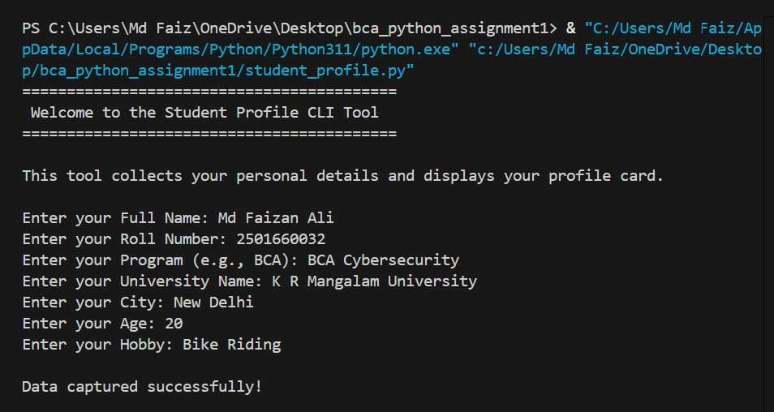
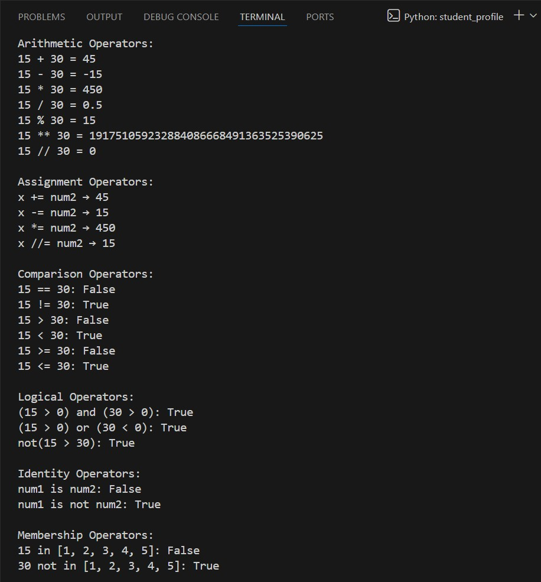
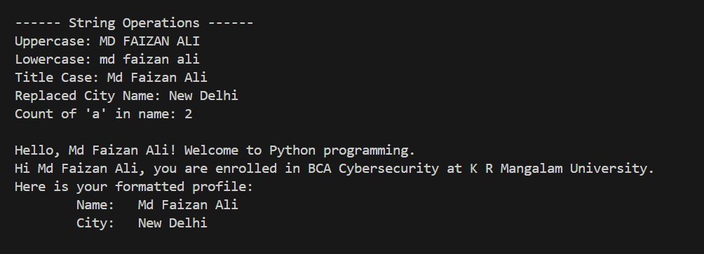
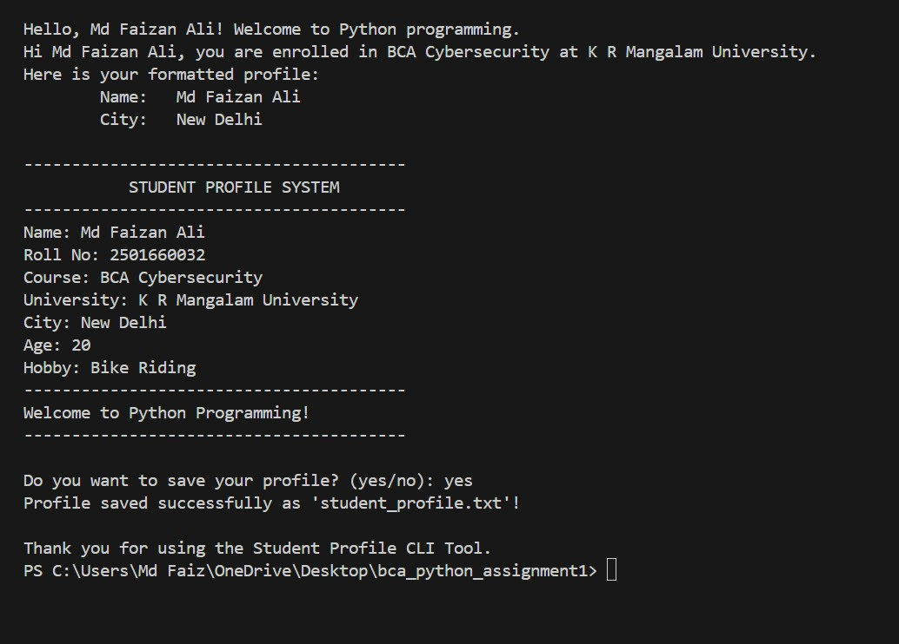
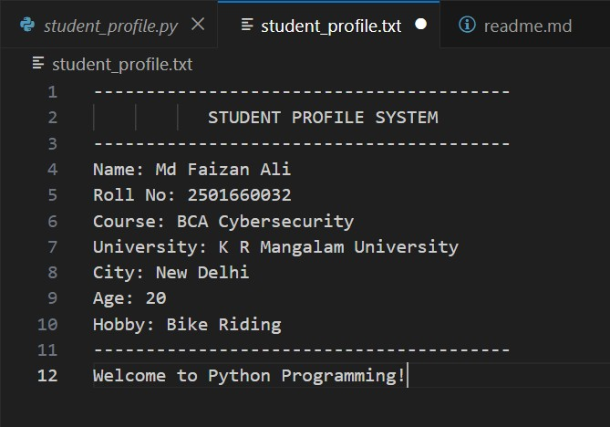

===========================================================
- Name: Md Faizan Ali
- Roll No: 2501660032
- Program: BCA (Cyber Security)
- Course Code: ETCCCPP103
- Course Name: Problem Solving with Python
- Faculty: Ms. Neha Kaushik
- Session: 2025-26 | Semester: I
- Assignment: Unit-2 Mini Project
- Title: Library Inventory & Borrowing System
- Date : 19-11-2025

===========================================================

# OUTPUT
1. Take Student Details (Name, Roll No, Program, University, City, Age, Hobby)  

   

2. Demonstrate all Python Operators  

   

3. Perform String Operations and Formatting  

   

4. Display a Formatted Student Profile Card  

   

5. Save Student Data to `student_profile.txt` (Bonus)  

    

# Student Profile Console App (Python CLI)
A simple **Python-based Command Line Interface (CLI)** tool that collects student information, performs basic operations, and displays a formatted profile card.  
This project demonstrates the core fundamentals of Python programming — input/output, variables, data types, operators, string manipulation, and file handling.

---

## Features
- Collect and store personal and academic details  
- Demonstrate arithmetic, comparison, logical, assignment, identity, and membership operators  
- Apply string concatenation, f-strings, escape characters, and string methods  
- Display a formatted student profile card  
- Option to save details to a text file (`student_profile.txt`)  

---

## Usage
1. Ensure **Python 3.8+** is installed on your system.  
   Verify installation:
   ```bash
   python --version